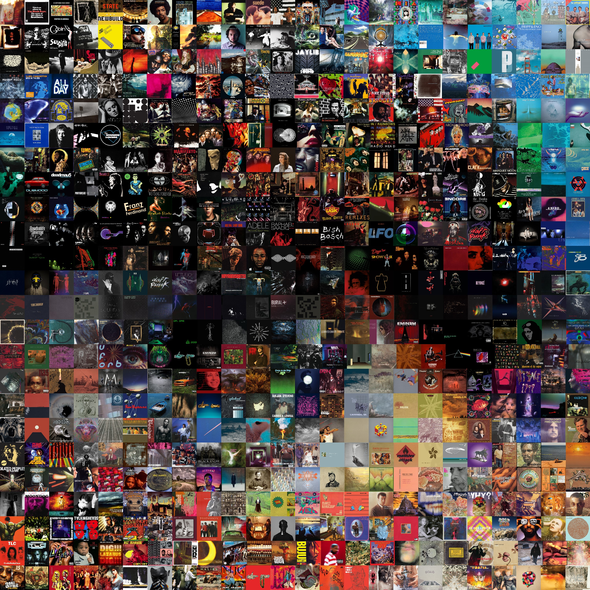

# Polyfoto

Create image mosaics.

*"Scott 3" by Scott Walker.*|*"Before and After Science" by Brian Eno.*
-|-
{:class="img-responsive"}|{:class="img-responsive"}

## Installation

Clone this repository to your local machine with git, then install using
Python.

```bash
git clone https://github.com/shanedrabing/polyfoto.git
cd polyfoto
python setup.py install
```

## Getting Started

Required arguments include:

- `-f` : Input file name. This is the target to recreate.
- `-d` : Input folder name. Contains images used to recreate the target.
- `-o` : Output file name. Name of the rendered canvas.
- `-n` : Number of rows. How many rows of images should be used in recreation?

```bash
python polyfoto.py -f input.png -d sources -o output.png -n 16
```

## Optional arguments

- `-p` : Proportional center of construction. 0 being the top of the canvas, 1
  being the bottom.
- `-s` : Rescaling factor. Normally 4x target size.
- `-t` : Pixel height of thumbnails. Used for the math operations, 16px height
  by default.
- `-x` : Output folder name for thumbnails. "tmp" by default.

## License

[MIT](https://choosealicense.com/licenses/mit/)
